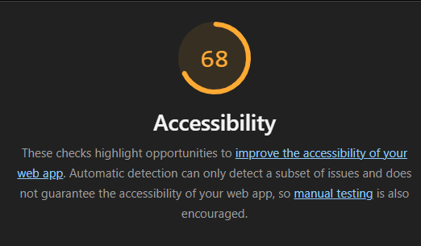
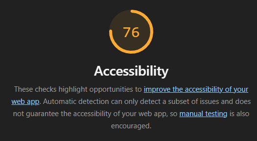
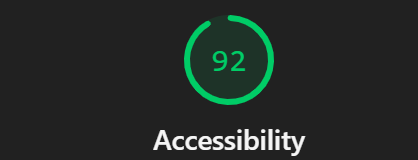

# Q1: Quels sont les arguments que vous pouvez utiliser pour convaincre votre Client de rendre son quizz accessible ? (Vous pouvez vous aider du cours)
Réponse:

Rendre un quiz accessible garantit l’égalité d’accès pour tous, y compris les personnes en situation de handicap, et permet de toucher un public plus large (utilisateurs mobiles, personnes âgées, connexions à faible débit). Cela améliore l’expérience utilisateur, renforce l’image de marque.

En Europe, l’accessibilité numérique s’inscrit aussi dans un cadre légal, notamment avec la directive européenne sur l’accessibilité du web et l’European Accessibility Act, qui impose progressivement des exigences d’accessibilité pour de nombreux services numériques.

Intégrer l’accessibilité dès la conception est donc à la fois plus simple, moins coûteux et permet d’anticiper les obligations réglementaires.

# Q2: Ajouter le screen de votre score :
Screen:

# Q3: Est-ce que l'analyse de Lighthouse est suffisante pour évaluer l'Accessibilité de votre Application ?
Réponse:
L’analyse de Lighthouse ne réalise qu’un audit automatisé partiel : elle ne teste pas réellement l’usage au clavier, l’expérience avec un lecteur d’écran, la compréhension du contenu, la pertinence des textes alternatifs ni les situations réelles d’usage. Donc non, on ne peut pas vraiment dire que l'analyse de Lighthouse est suffisante pour évaluer l'accessibilité.

# Q4: Combien de fois vous devez utiliser une touche du clavier pour passer le quizz ?
Réponse:
31 fois environ

# Q5: Donner 3 roles ARIA et 3 propriété ARIA
Réponse:

3 rôles ARIA :
- button
- navigation
- dialog

3 propriétés / attributs ARIA :
- aria-label
- aria-hidden
- aria-expanded

# Q6: Ajouter le screen de votre score Lighthouse
Screen:

# Q7: L'une des best practice de l'ARIA est "ne pas utiliser l'ARIA" pouvez nous expliquer pourquoi d'après vous ?
Réponse:

C’est l’une des bonnes pratiques de l’ARIA : si le HTML est utilisé de manière sémantique (chaque balise utilisée selon son sens, pas seulement son style), il fournit déjà les rôles et comportements accessibles de base. ARIA sert surtout à compléter ou corriger l’accessibilité lorsque le HTML seul ne suffit pas. Si l’on utilise déjà correctement le HTML sémantique, ajouter ARIA serait souvent redondant et inutile.

# Q8: Ajouter le screen de votre score Lighthouse
Screen:

# Q9: Pourquoi le score de lighthouse n'a pas augmenté d'après vous ?
Réponse:
Même si on a amélioré la sémantique de notre page web, Lighthouse ne le prend pas en compte si d'autres critères comme le contraste, les labels etc... restent inchangés.

# Q10: Quel est la valeur du rapport de contraste actuel :
Réponse: 
2.38

# Q11: Quel est la valeur du score AA :
Réponse:
3.0

# Q12: Quel est la valeur du score AAA :
Réponse:
4.5

# Q13: Comment pouvez vous changer la valeur du contraste de votre texte ?
Réponse:

Pour améliorer la valeur du contraste, il faut choisir des couleurs de texte qui sont plus foncées ou plus claires que le fond et du coup éviter des couleurs proches du fond.

# Q14: Ajouter le screen de votre score Lighthouse
Screen:

# Q15: Êtes vous capable de déterminer visuellement ce qui est un lien ou pas en appliquant chaque altérations ?
Réponse:
Je vois bien l'assombrissement quand je passe ma souris ce qui indique un lien mais une personne non habitué pourrait confondre avec une image.

# Q16: Ajouter le screen de votre score Lighthouse
Screen:

# Q17:  Proposition 1
Description:
Nb d'actions gagnée : 

# Q18:  Proposition 2
Description:
Nb d'actions gagnée : 

# Q19:  Proposition 3
Description:
Nb d'actions gagnée : 
